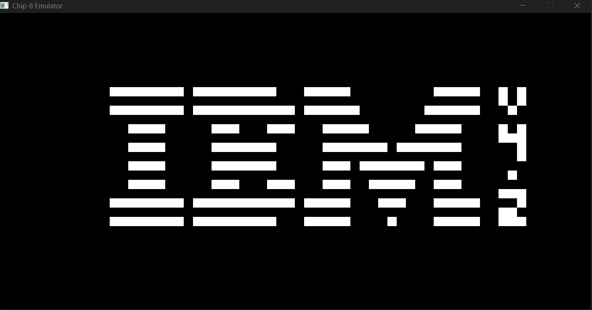

# Chip-8 Emulator
A personal project exploring the basics of console emulation, including CPU emulation, ROM loading, display, audio, and input capture.
## Features:
* CPU and memory initialization
* ROM loading and execution
* ~80% of Chip-8 instructions implemented
* Working display output

## Preview:

This screenshot shows the output of a ROM that tests the IBM logo display and runs in an infinite loop.